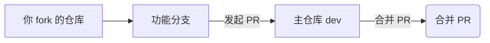

# 为 taro_mini 项目贡献代码

感谢你对 `taro_mini` 项目的关注！本文档将指导你通过 **Pull Request (PR)** 流程，向本仓库提交代码或修复问题。

## 📦 仓库信息

- **主仓库**：https://gitee.com/damn_2/taro_mini
- **包管理器**：yarn
- **分支说明**：
  - `master`：主分支，生产环境代码，仅接收已测试稳定的代码
  - `dev`：开发分支，日常开发基于此分支进行

## 🚀 完整贡献流程

整个过程分为 7 步：**Fork → 克隆 → 同步 → 创建分支 → 开发 → 推送 → 发起 PR**

### 1. Fork 项目到个人账户

1. 打开主仓库：https://gitee.com/damn_2/taro_mini
2. 点击右上角的 **Fork** 按钮
3. 选择你的个人空间，等待 fork 完成

### 2. 将代码克隆到本地

```bash
# 克隆你 fork 的仓库
git clone https://gitee.com/你的用户名/taro_mini.git

# 进入项目目录
cd taro_mini

# 使用 yarn 安装依赖
yarn install
```

### 3. 添加主仓库为上游源

```bash
# 添加主仓库地址，命名为 upstream
git remote add upstream https://gitee.com/damn_2/taro_mini.git

# 验证远程仓库配置（应看到 origin 和 upstream）
git remote -v
```

### 4. 同步开发分支代码

**重要**：所有开发都基于 `dev` 分支，请勿直接在 `master` 上修改。

```bash
# 切换到 dev 分支
git checkout dev

# 拉取主仓库 dev 分支的最新代码
git pull upstream dev

# 同步到你自己的远程仓库（可选）
git push origin dev
```

### 5. 创建功能分支

请基于 `dev` 分支创建你的功能分支，命名应具有描述性：

```bash
# 确保当前在 dev 分支
git checkout dev

# 拉取最新代码（再次确认）
git pull upstream dev

# 创建并切换到功能分支
# 分支命名格式：类型/功能描述
git checkout -b feat/your-feature-name
```

**分支命名规范**：

| 类型 | 格式示例 | 说明 |
|------|----------|------|
| 新功能 | `feat/login-page` | 新增功能 |
| Bug 修复 | `fix/slider-error` | 修复问题 |
| 文档更新 | `docs/api-guide` | 仅文档变更 |
| 样式调整 | `style/home-layout` | UI/样式改动 |
| 性能优化 | `perf/load-speed` | 性能相关 |
| 重构 | `refactor/utils` | 代码重构 |

### 6. 进行开发与提交

```bash
# 查看修改状态
git status

# 添加修改的文件
git add .                    # 添加全部
# 或 yarn add 指定文件
git add src/pages/login.vue

# 提交修改（遵循规范）
git commit -m "feat: 添加登录页面"

# 如果有多个改动，建议分多次提交
git commit -m "fix: 修复表单校验问题"
```

**Commit 信息规范**：

```
<类型>: <简短描述>

<详细说明（可选）>
```

示例：
```
feat: 添加用户登录页面

- 实现手机号/密码登录
- 添加表单校验
- 接入登录接口
```

### 7. 推送到你的远程仓库

```bash
# 推送功能分支到 origin（你自己的仓库）
git push origin feat/your-feature-name
```

### 8. 发起 Pull Request (PR)

1. 打开**你的 Fork 仓库**：`https://gitee.com/你的用户名/taro_mini`
2. 点击 **Pull Requests** → **+ Pull Request**
3. **重要**：正确选择目标分支：
   - **源分支**：你的仓库 / `feat/your-feature-name`
   - **目标分支**：`damn_2/taro_mini` / `dev`（⚠️ 注意是 dev，不是 master）

**PR 信息填写模板**：

```markdown
## 变更说明
<!-- 描述本次 PR 做了什么 -->

## 关联 Issue
<!-- 如有相关 Issue，填写 #编号 -->

## 测试情况
- [ ] 本地测试通过
- [ ] yarn lint 通过
- [ ] 不影响现有功能

## 变更类型
- [ ] 新功能 (feat)
- [ ] Bug 修复 (fix)
- [ ] 文档 (docs)
- [ ] 样式 (style)
- [ ] 重构 (refactor)

## 截图（如涉及 UI）
<!-- 粘贴截图链接 -->
```

## 🔄 同步主仓库最新代码

如果你的开发周期较长，`dev` 分支可能有新代码合入。**在发起 PR 前**，建议先同步：

```bash
# 1. 切换到 dev 分支
git checkout dev

# 2. 拉取主仓库最新代码
git pull upstream dev

# 3. 同步到你的远程仓库
git push origin dev

# 4. 切换回功能分支
git checkout feat/your-feature-name

# 5. 将 dev 的更新合并进来
git merge dev

# 6. 如有冲突，解决后提交
git add .
git commit -m "merge: 同步 dev 最新代码"
git push origin feat/your-feature-name
```

### 冲突解决方法

如果 `git merge dev` 提示冲突：

1. 打开冲突文件，找到 `<<<<<<<`、`=======`、`>>>>>>>` 标记
2. 手动编辑，保留需要的代码
3. 删除标记行
4. 执行 `git add .` → `git commit` → `git push`

## ✅ PR 提交后

- **等待审核**：维护者会审阅你的代码
- **自动检查**：确保 CI 检查（如有）全部通过
- **响应修改**：如需修改，直接在本地同一分支继续 → `git add` → `git commit` → `git push`，PR 会自动更新
- **合并后**：代码会先进入 `dev` 分支，经过测试后才会合并到 `master`

## 📌 分支工作流图示



**版本发布流程**：
- 日常开发 → 向 `dev` 分支提交 PR
- 测试稳定后 → 由维护者将 `dev` 合并到 `master` 并打 tag 发布

## 🧪 开发环境

```bash
# Node.js 版本建议
node -v  # v16 或更高

# 安装依赖
yarn install

# 启动开发服务器（根据项目配置调整）
yarn dev

# 代码检查
yarn lint

# 构建
yarn build
```

## 📋 常见问题

| 问题 | 解决方法 |
|------|----------|
| `yarn: command not found` | `npm install -g yarn` |
| 忘记切换分支直接在 master 改了 | `git checkout -b feat/xxx` 将修改移到新分支 |
| push 被拒绝 | `git pull --rebase origin feat/xxx` 后再 push |
| PR 提交到了 master 而不是 dev | 关闭 PR，重新发起，目标分支选 dev |
| 提交信息写错了 | `git commit --amend -m "新的信息"` 然后 `git push --force-with-lease` |

## 💡 贡献建议

- **先提 Issue**：较大改动建议先提 Issue 讨论方案
- **单一职责**：每个 PR 只做一件事，便于审核
- **保持更新**：提交 PR 前确保已同步最新的 `dev` 代码
- **写清楚描述**：让维护者明白你改了什么、为什么改

---

再次感谢你的贡献！🎉
